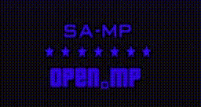

# SAMP-RGB-Textdraw
rgb-textdraw.inc is an include for [open-mp](//open.mp/) and [sa-mp](//sa-mp.com/).

You can add RGB to textdraw, textdraw colour will change smoothly.




# How To Install
**SA-MP**
1. Extract the rgb-textdraw.inc into the `/pawno/include` directory of your SA-MP server.
2. Import include in your gamemode script `#include <rgb-textdraw>`

**OPEN.MP**
1. Extract the omp-rgb-textdraw.inc into the `/qawno/include` directory of your OPEN.MP server.
2. Import include in your gamemode script `#include <omp-rgb-textdraw>`

Note: You have to import `#include <YSI_Data\y_iterate>` or `#include <foreach>` for use this include

# How To Use
```pawn
// Import includes
#include <YSI_Data\y_iterate>
#include <rgb-textdraw>

// Defining textdraw variables
new Text: MyTextDraw_1;
new PlayerText: MyPlayerTextDraw_1[MAX_PLAYERS];

public OnGameModeInit() 
{
	// Create a global textdraw
	MyTextDraw_1 = TextDrawCreate(1.600000, 448.062896, "box");
	TextDrawLetterSize(MyTextDraw_1, 0.000000, 0.095000);
	TextDrawTextSize(MyTextDraw_1, 639.300170, 0.000000);
	TextDrawAlignment(MyTextDraw_1, 1);
	TextDrawColor(MyTextDraw_1, -1);
	TextDrawUseBox(MyTextDraw_1, 1);
	TextDrawBoxColor(MyTextDraw_1, 255);
	TextDrawSetShadow(MyTextDraw_1, 0);
	TextDrawBackgroundColor(MyTextDraw_1, 255);
	TextDrawFont(MyTextDraw_1, 1);
	TextDrawSetProportional(MyTextDraw_1, 1);
	
	// Add RGB to global textdraw `MyTextDraw_1`
	AddRGBToTextDraw(MyTextDraw_1, .color = false, .bgcolor = false, .boxcolor = true); // boxcolor only
}

public OnPlayerConnect(playerid) {
	// Show the global textdraw `MyTextDraw_1` for the playerid
	TextDrawShowForPlayer(playerid, MyTextDraw_1);
	
	// Create a player textdraw
	MyPlayerTextDraw_1[playerid] = CreatePlayerTextDraw(playerid, 570.396240, 132.500198, "Hello World!");
	PlayerTextDrawLetterSize(playerid, MyPlayerTextDraw_1[playerid], 0.534999, 1.634999);
	PlayerTextDrawTextSize(playerid, MyPlayerTextDraw_1[playerid], 0.000000, 133.000000);
	PlayerTextDrawAlignment(playerid, MyPlayerTextDraw_1[playerid], 2);
	PlayerTextDrawColor(playerid, MyPlayerTextDraw_1[playerid], -1);
	PlayerTextDrawSetShadow(playerid, MyPlayerTextDraw_1[playerid], 8);
	PlayerTextDrawSetOutline(playerid, MyPlayerTextDraw_1[playerid], 1);
	PlayerTextDrawBackgroundColor(playerid, MyPlayerTextDraw_1[playerid], 255);
	PlayerTextDrawFont(playerid, MyPlayerTextDraw_1[playerid], 0);
	PlayerTextDrawSetProportional(playerid, MyPlayerTextDraw_1[playerid], 1);
	
	// Add RGB to player textdraw `MyPlayerTextDraw_1`
	AddRGBToPlayerTextDraw(playerid, MyPlayerTextDraw_1[playerid], .color = true);
	
	// Show the player textdraw `MyPlayerTextDraw_1` for the playerid
	PlayerTextDrawShow(playerid, MyPlayerTextDraw_1[playerid]);
}
```

Note: If the textdraw string contain colors `(~r~ ~y~ ...)` it will have no effect, so remove them.

# Functions
```pawn
//Global Textdraw:
native AddRGBToTextDraw(Text:text, bool: color = true, bool: bgcolor = false, bool: boxcolor = false);
native RemoveRGBFromTextDraw(Text:text);
native SetRGBTextDrawInfo(Text:text, bool: color, bool: bgcolor, bool: boxcolor);
native RGBTextDrawShowForPlayer(playerid, Text:text);
native RGBTextDrawHideForPlayer(playerid, Text:text);

//Player Textdraw:
native AddRGBToPlayerTextDraw(playerid, PlayerText:text, bool: color = true, bool: bgcolor = false, bool: boxcolor = false);
native RemoveRGBFromPlayerTextDraw(playerid, PlayerText:text);
native SetRGBPlayerTextDrawInfo(playerid, PlayerText:text, bool: color, bool: bgcolor, bool: boxcolor);
native RGBPlayerTextDrawShow(playerid, PlayerText:text);
native RGBPlayerTextDrawHide(playerid, PlayerText:text);
```

# Credits
* adib_yg for the include.
* [Y_Less](//github.com/Y-Less/) for [YSI-Includes](https://github.com/pawn-lang/YSI-Includes).
